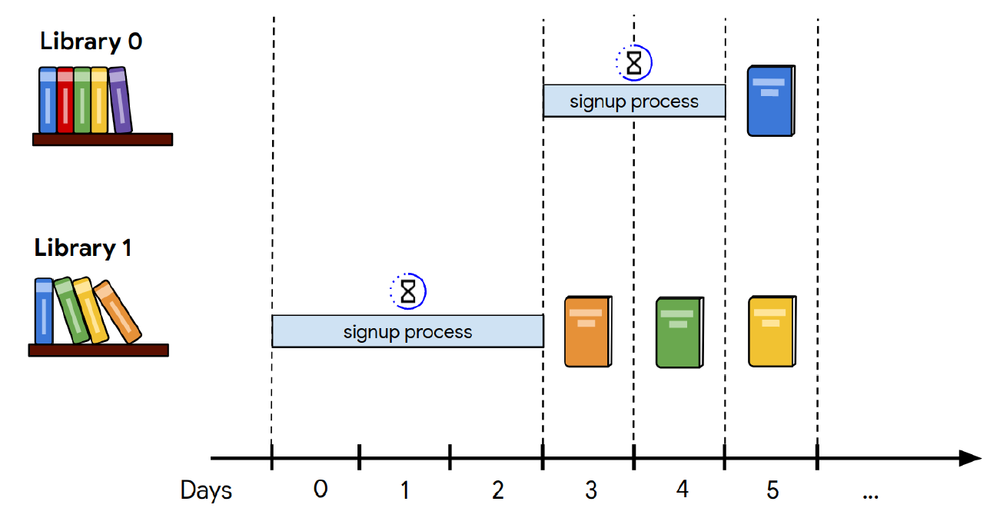

### Keywords: Java, Optimization, Algorithm Design, Google Hash Code, 
# Google Hash Code 2020 - Qualification Round

## Hash Code

Hash Code is a programming competition holds every year. Hash code provides you the chance to work in your team and share your skills with others. It is an amazing experience to work in a team, challenge your knowledge in programming and problem solving and algorithmic thinking. If you are an expert Hash code is for you to show up, or you are a beginner, hash code competitions are the best to practice and hone your skills.

## Challenge

The task was about scanning books in libraries. It takes some time to get ready a library for sending the books for scanning. Scanning capacity is different from library to library and the score given for a scanned book is variable. The aim is designing an algorithm that get the most score. Also you have to keep in mind that a book may exists in several libraries and regardless of copies of a book, one it is scanned the score is counted once. 

## Solution
During the competition my groupmates and I used python since it was the only programing language we agreed on. During the competition we came up with the solution, we solved the small samples, but for those big samples, because of the lack of computiation power we missed the corresponding scores. Python is popular but not as fast as C/C++. So I wrote our solution in Java which is faster than Python. What you might find in this repository is the Java version of the solution.
The python solution is ready but not shared so far. Once it is ready I will shared the repository link here.
Quick Tip: If you feel comfortable with python language and need the performance of C/C++, Julia the new born programming language is an alternative.
